## Introduction
This report provides a performance evaluation of ten embedded key-value (K-V)
store library options available to Java applications. It evaluates a range of
small (99 MB) to large (152 GB) workloads that can be easily stored in memory on
server-grade hardware. The evaluation includes the write performance, actual
storage required, and a range of read scenarios including fetching entries by
key, sequentially iterating over all entries, reverse iterating over all
entries, computing a sequential CRC32 of all entries, and computing a sequential
xxHash of all entries. The write benchmarks and read by key benchmarks are
evaluated when keys are provided in both sequential and random order.

This report generally confirms separately-reported findings that
[LSM](https://en.wikipedia.org/wiki/Log-structured_merge-tree)-based
implementations often provide faster write performance and higher
storage space efficiency than the
[B+ Tree](https://en.wikipedia.org/wiki/B%2B_tree)-based alternatives. However
write performance benefits of LSM disappears as larger values are used,
reflecting the high cost of LSM write amplification. With careful selection of
entry sizes, the storage overhead can also be minimised to immaterial levels.

## Methodology
The benchmark was executed on 10 July 2016 using
[LmdbJava Benchmarks](https://github.com/lmdbjava/benchmarks) rev b643a1e with
OpenHFT [Chronicle Map](https://github.com/OpenHFT/Chronicle-Map) 3.9.0,
[LmdbJava](https://github.com/lmdbjava/lmdbjava) 0.0.1 (`BB` and `DB`),
[LMDBJNI](https://github.com/deephacks/lmdbjni) 0.4.6 (`JNI`),
[Lightweight Java Game Library](https://github.com/LWJGL/lwjgl3/) 3.0.1-SNAPSHOT (`JGL`),
[LevelDBJNI](https://github.com/fusesource/leveldbjni) 1.8,
[MapDB](http://www.mapdb.org/) 3.0.0-RC2
H2 [MVStore](http://h2database.com/html/mvstore.html) 1.4.192
[RocksDBJNI](http://rocksdb.org/) 4.5.1 and
JetBrains [Xodus](https://github.com/JetBrains/xodus) 1.0.0.
Libraries that rely upon native code used the shared native libraries that
were bundled within each JAR and loaded by the relevant library at runtime.

The test server had 512 GB RAM and 2 x Intel Xeon E5-2667 v 3 CPUs. The `/tmp`
directory (on a 256 GB `tmpfs` file system) was used as the work directory
during each benchmark. The server was running Linux 4.6.3 (x86_64) with
Java 1.8.0_92, and had its `/etc/security/limits.conf` configured with soft and
hard `nofile` limits of 1,000,000.

The tests and graphs can be reproduced by checking out the previously-specified
LmdbJava Benchmarks version on a Linux server with the required `nofile`
configuration. Run `mvn clean package; ./results/run.sh; mkdir -p results/date;
mv out-* results/date; cd results/date; ../results/process.sh`. The resulting
graphs and data files can be found in the `results/date` directory.

The raw, unedited CSV, TXT, DAT, MD and PNG output files produced by the above
commands are provided in the same GitHub directory as this README. The only edit
was to remove Xodus from the `out-6.csv` file given its performance distorted
the `6-*.png` graphs. The original Xodus test 6 results remain in `out-6.txt`.

## Results
Five benchmarks are reported:

* `readCrc`: Iterate over ordered entries, computing a CRC32 of keys and values
* `readSeq`: Iterate over ordered entries, sending each value to the black hole
* `readRev`: Same as `readSeq`, except operating in reverse order
* `readXxh64`: Same as `readCrc`, except computing an XXH64 via
  [Zero-Allocation-Hashing](https://github.com/OpenHFT/Zero-Allocation-Hashing)
  (ZAH XXH64 is currently the fastest JVM hasher, as separately benchmarked via
  [Hash-Bench](https://github.com/benalexau/hash-bench))
* `write`: Write the 1M/10M entries out in an implementation-optimal manner (eg
  via a single transaction or batch if supported)

To make the graphs and associated discussion more concise, the follow terms are
used:

* Int: 32-bit signed integer (using the implementation's default byte ordering)
* M: Million
* Ms: Milliseconds
* Rnd: Random data access (ie integers selected from a
  [Mersenne Twister](https://en.wikipedia.org/wiki/Mersenne_Twister))
* Seq: Sequential data access (ie ordered integers from 0 to 1M/10M)
* Str: 16 byte string containing a zero-padded integer (no length prefix or null
  terminator)

All storage sizes referred to in this report reflect the bytes actually consumed
by the library's assigned work directory just after it closed. The reported
values were provided by POSIX `stat` calls, and as such reflect the actual
storage required (as opposed to the "apparent" size which would be reported by
an `ls` command or `File.length()`).

The TXT files also include the size of each library's assigned work directory
immediately prior to being asked to close, and in LMDB's case, the size of a
`MDB_CP_COMPACT`-based copy of the environment. Neither of these latter two
measurements differ materially from the post-close size, and therefore the
post-close size is reported for simplicity.

Chronicle Map is only benchmarked for the `readKey` and `write` workloads. This
is because Chronicle Map does not provide an ordered key iterator, and such an
iterator is required for the remaining benchmark read methods (ie `readSeq`,
`readRev`, `readCrc` and `readXxh64`).

## Test 1: LMDB Implementation Settings
To ensure appropriate LMDB defaults are used for the remainder of the benchmark,
several key LmdbJava and LMDB settings were benchmarked.

These benchmarks all used 1M sequential integer keys X 100 byte values.

### Force Safe

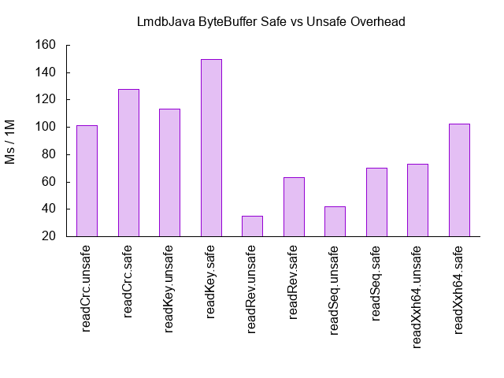

LmdbJava supports several buffer types, including Agrona `DirectBuffer`
and Java's `ByteBuffer` (BB). The BB can be used in a safe mode or an
`Unsafe`-based mode. The latter is the default. The above graph illustrates a
consistent penalty when forcing safe mode to be used, as would be expected.
`Unsafe` BB is therefore used for LmdbJava in the remainder of the benchmark.

### Sync

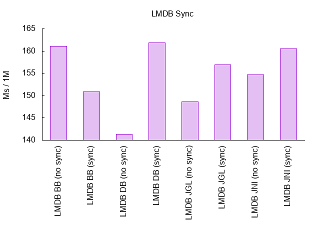

The above graph shows the impact of the LMDB Env `MDB_NOSYNC` flag. As expected,
requiring a sync is consistently slower than not requiring it. Forced syncs are
disabled for the remainder of the benchmark.

### Write Map

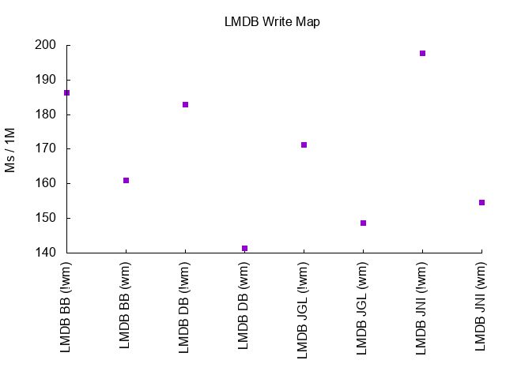

LMDB also supports a `MDB_WRITEMAP` flag, which enables a writable memory map.
Enabling the write map (shown as `(wm)` above) results in improved write
latencies. It remains enabled for the remainder of the benchmark.

### Meta Sync

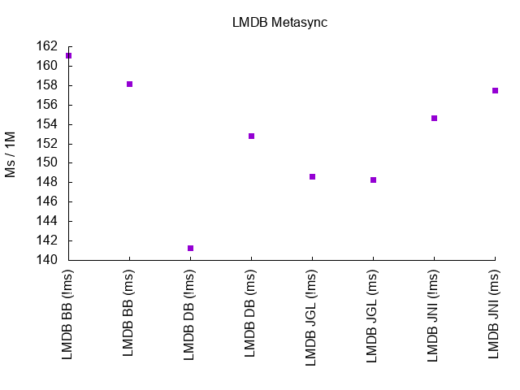

This final LMDB-specific benchmark explores the write latency impact of the
`MDB_NOMETASYNC` flag. This flag prevents an fsync metapage after commit. Given
the results are inconclusive across different buffer types, it will be disabled
for the remainder of the benchmark.

## Test 2: Determine ~2/4/8/16 KB Byte Values
Some of the later tests require larger value sizes in order to explore the
behaviour at higher memory workloads. This second test was therefore focused
on finding reasonable byte values around 2, 4, 8 and 16 KB. Only the native
implementations were benchmarked.

This benchmark wrote 1M randomly-ordered integer keys, with value sizes
as indicated on the horizontal axis.

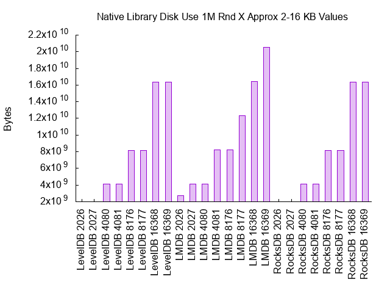

As shown, LevelDB and RocksDB achieve consistent storage of these 1M entries.
There are small increases in storage requirements that are commensurate with the
additional bytes in each value.

On the other hand, LMDB requires more storage for all value sizes and shows
degradation if entry sizes are not well-aligned with LMDB's page size. The
graphs show that exceeding the entry size by a single byte will require an
additional page. For example, moving from 2,026 byte values (so a 2,030 byte
entry including the 4 byte integer key) to a 2,027 byte value increased the
on-disk size from 2,745,884,672 to 4,128,489,472 bytes. If storage space is an
issue, it is important that entry sizes reflect LMDB's page sizing requirements.
In summary its optimal entry sizes are (in bytes) 2,030, 4,084, 8,180, 12,276
and so on in 4,096 byte increments.

Given there is no disadvantage to LevelDB or RocksDB by using entry sizes that
align well with LMDB's page sizes, these will be used in later tests. Ensuring
overall storage requirements are similar also enables a more reasonable
comparison of each library's performance (as distinct from storage) trade-offs.

## Test 3: LevelDB, RocksDB and Xodus Batch Sizes

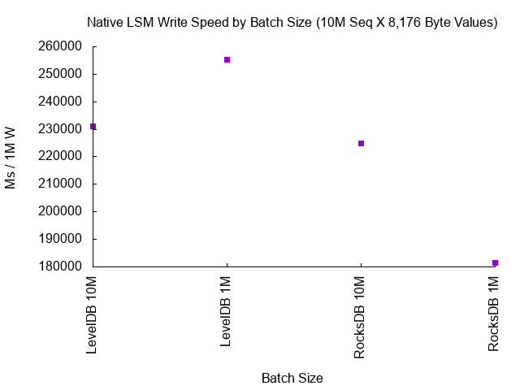

LevelDB, RocksDB and Xodus are all LSM-based stores and benefit from inserting
data in batches. Early testing of Xodus with large value sizes and large batch
sizes rapidly led to Java out of memory exceptions (with the default JMH-forked
JVM memory configuration). As such, a static write batch size of 1,000 was
always used for Xodus.

LevelDB and RocksDB both handled large value sizes with a variety of very large
batch sizes. The above graph illustrates the batch size impact when writing 10M
sequential integer keys X 8,176 byte values.

As shown, LevelDB write latency is lowest when the batch size was 10M, whereas
RocksDB worked better with a batch size of 1M. Given RocksDB with 1M offered
the fastest performance of the four tested LSM combinations above, 1M will be
used as the batch size in later tests.

While on the issue of LSM batch sizes, our original tests found that RocksDB
failed with insufficient file handles when using large batch sizes. This was
overcome with the `nofile` adjustment mentioned earlier. It is therefore
important to consider the impact of LSM-based implementations on servers with
file handle constraints. Such constraints may be related to memory, competing
uses (eg network connections) or security policies (eg a shared server with
lower per-user file handle limits).

One limitation of this report is it only measures the time taken for the client
thread to complete a given read or write workload. The LSM-based implementations
also use a separate "compaction thread" to rewrite the data. This thread
overhead is therefore not measured by the benchmark and not reported here. Given
the compaction thread remains very busy during sustained write operations, the
LSM-based implementations reduce the availability of a second core for end user
application workloads. This may be of concern on CPU-constrained servers (and in
particular low cost cloud deployments with limited VM cores per instance).

Finally, LSM-based implementations typically offer considerable
[tuning options](https://github.com/facebook/rocksdb/wiki/RocksDB-Tuning-Guide).
Users are expected to tune the store based on their workload type, storage type
and file system configuration (block size, parity etc). Such extensive tuning
was not conducted in this benchmark because the workload was very comfortably
memory-bound and an effort had already been made to determine reasonable batch
sizes. A production LSM deployment will need to tune these parameters carefully.
A key feature of the non-LSM implementations is they do not require such tuning.

## Test 4: 1 Million X 100 Byte Values
Now that appropriate settings have been verified, this is the first test of all
implementations. In all of these benchmarks we are inserting 1M entries.
The vertical (y) axis of each performance graph uses a log scale.

### Storage Use

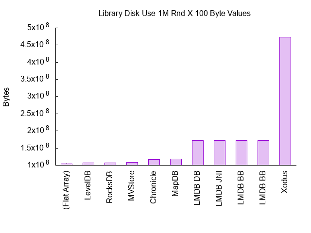

| Implementation | Bytes | Overhead % |
| -------------- | ----: | ---------: |
| (Flat Array) | 104,000,000 |  |
| LevelDB | 107,036,672 | 2.91 |
| RocksDB | 107,057,152 | 2.93 |
| MVStore | 108,937,216 | 4.74 |
| Chronicle | 116,801,536 | 12.30 |
| MapDB | 118,489,088 | 13.93 |
| LMDB DB | 171,601,920 | 65.00 |
| LMDB JNI | 171,896,832 | 65.28 |
| LMDB BB | 172,040,192 | 65.42 |
| LMDB BB | 172,314,624 | 65.68 |
| Xodus | 473,067,520 | 354.87 |

We begin by reviewing the storage space required by each implementation's
memory-mapped files. We can see that LevelDB and RocksDB are very efficient,
requiring less than 3% overhead to store the data. LMDB requires around 65%
more bytes than the size of a flat array, due to its
[B+ tree](https://en.wikipedia.org/wiki/B%2B_tree) layout and
[copy-on-write](https://en.wikipedia.org/wiki/Copy-on-write) page allocation
approach. These collectively provide higher read performance and LMDB's MVCC
ACID transactional support. As we will see later, this overhead reduces as the
value sizes are increased. It is unclear why Xodus produces an output directory
4.5 times larger than a flat array.

### 99 MB Sequential Access (Integers)

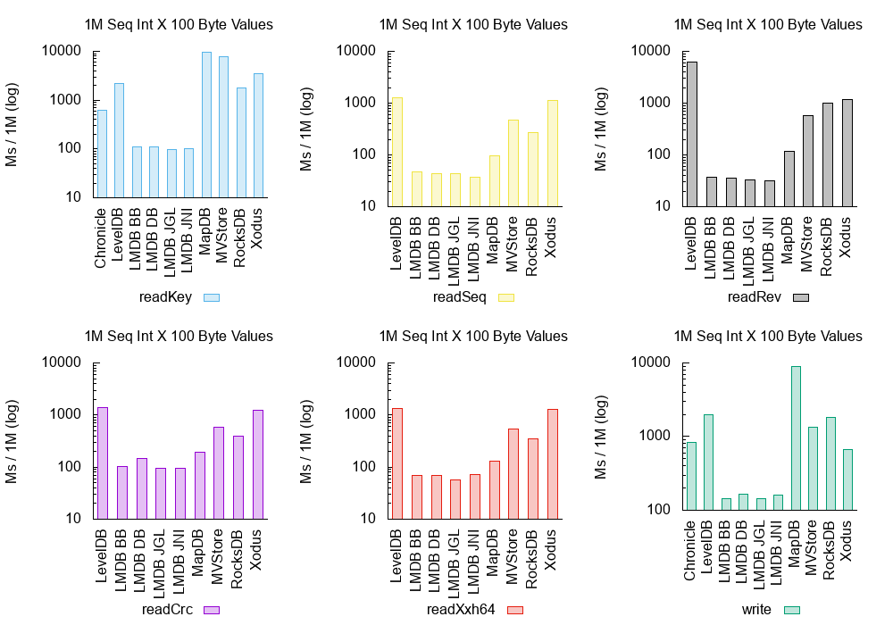

We start with the most mechanically sympathetic workload. If you have integer
keys and can insert them in sequential order, the above graphs illustrate the
type of latencies achievable across the various implementations. LMDB is clearly
the fastest option, even (surprisingly) including writes.

### 110 MB Sequential Access (String)

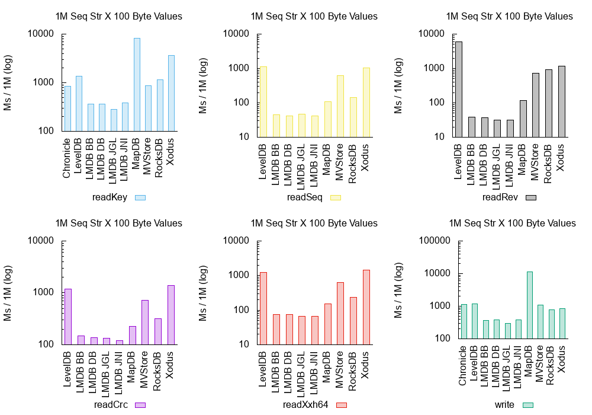

Here we simply run the same benchmark as before, but with string keys instead
of integer keys. Our string keys are the same integers as our last benchmark,
but this time they are recorded as a zero-padded string. LMDB continues to
perform better than any alternative, including for writes. This confirms the
previous result seen with sequentially-inserted integer keys.

### 99 MB Random Access (Integers)

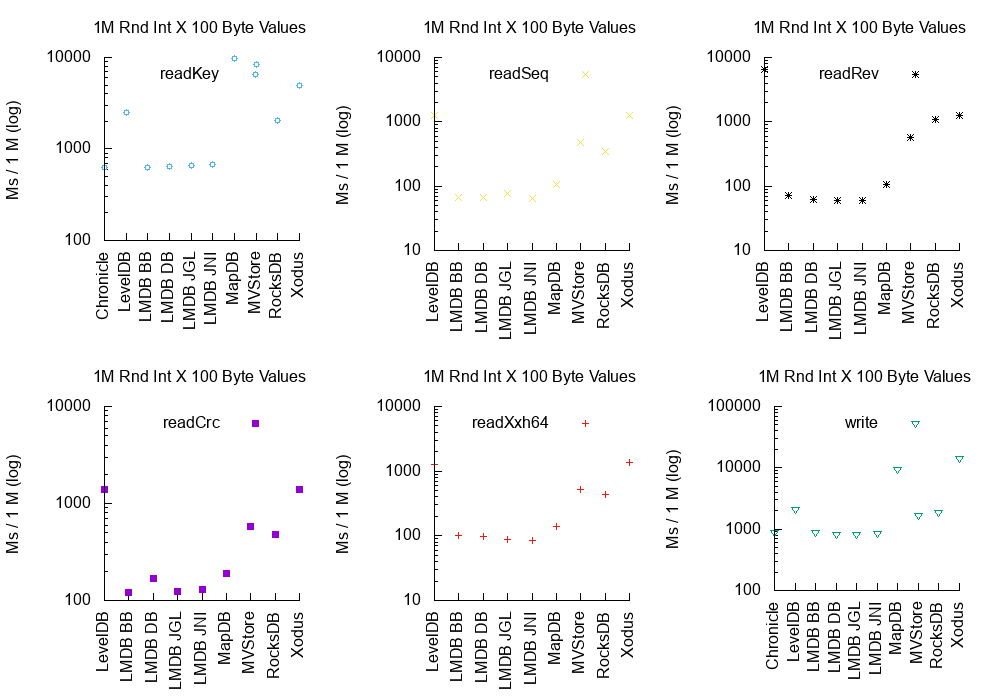

Next up we farewell mechanical sympathy and apply some random workloads. Here
we write the keys out in random order, and we read them back (the `readKey`
benchmark) in that same random order. The remaining operations are all cursors
over sequentially-ordered keys. The graphs show LMDB is consistently faster for
all operations, even including writes.

### 110 MB Random Access (Strings)

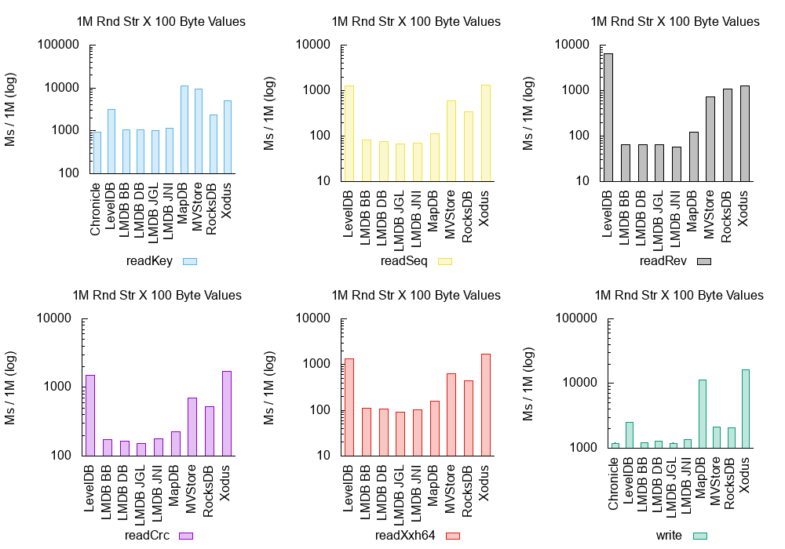

This benchmark is the same as the previous, except with our zero-padded string
keys. There are no surprises; we see similar results as previously reported.

## Test 5: 10 Million X 2,026 Byte Values

In our fifth test we burden the implementations with a larger workload to see
how they perform. We store 10 million entries with 2,026 byte values, which is
roughly 19 GB RAM before implementation overhead.

It was hoped that all implementations above could be benchmarked. However
MVStore crashed with `java.lang.OutOfMemoryError: Capacity: 2147483647`.

Given test 4 showed the integer and string keys perform effectively the same,
to reduce execution time this test only includes the integer keys. Similarly we
reduce execution time by discontinuing the `readRev`, `readCrc` and `readXxh64`
sequential cursor benchmarks (we do retain `readSeq` to illustrate cursor
performance though).

### Storage Use

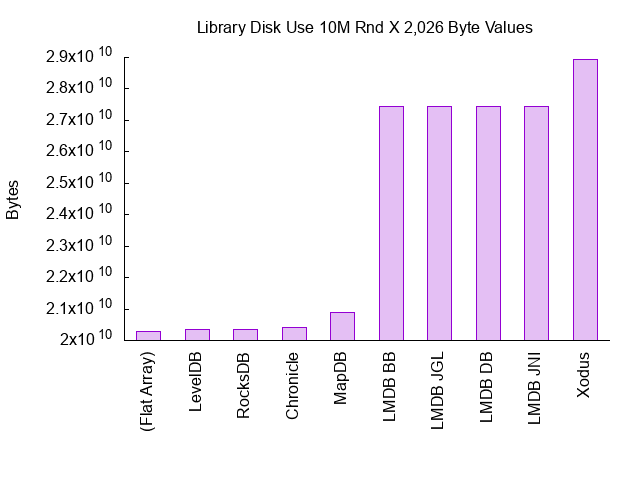

| Implementation | Bytes | Overhead % |
| -------------- | ----: | ---------: |
| (Flat Array) | 20,300,000,000 |  |
| LevelDB | 20,344,360,960 | .21 |
| RocksDB | 20,344,381,440 | .21 |
| Chronicle | 20,412,694,528 | .55 |
| MapDB | 20,901,265,408 | 2.96 |
| LMDB BB | 27,439,894,528 | 35.17 |
| LMDB JGL | 27,441,250,304 | 35.17 |
| LMDB DB | 27,441,627,136 | 35.18 |
| LMDB JNI | 27,441,889,280 | 35.18 |
| Xodus | 28,929,896,448 | 42.51 |

As with test 4, we begin by reviewing the storage space required by the
memory-mapped files. The above graph shows the larger, random ordered use case.
All implementations offer much better storage efficiency now that the value
sizes have increased (from 100 bytes in test 4 to 2,026 bytes in test 5).

### 19 GB Sequential Access

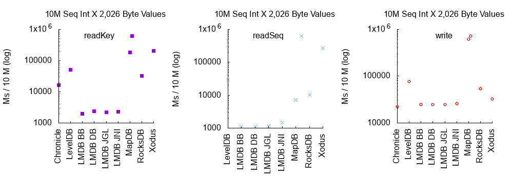

Starting with the most optimistic scenario of sequential keys, we see LMDB
out-perform the alternatives for both read and write workloads. Chronicle Map's
write performance is good, but it should be remembered that it is not
an index suitable for ordered key iteration.

### 19 GB Random Access

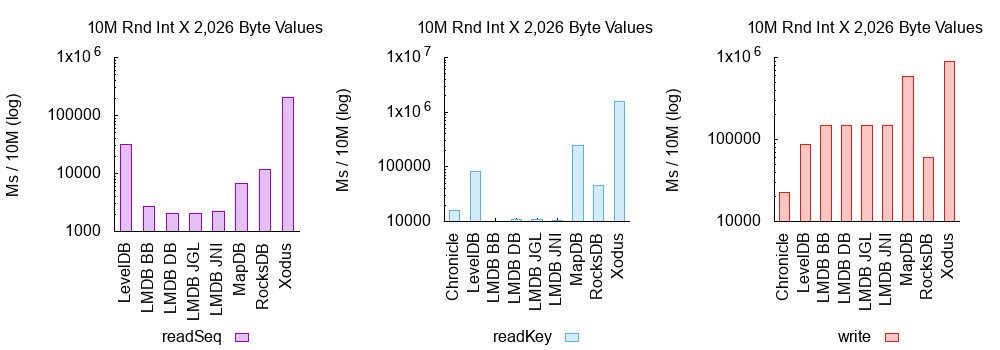

LMDB easily remains the fastest with random reads. However, random writes
involving these larger values are a different story, with the two native LSM
implementations completing the write workloads much faster than LMDB. In the
graph we see Chronicle Map coming in first (22 seconds), albeit without the
overhead of maintaining sorted keys. RocksDB is the fastest sorting
implementation (59 seconds), followed closely behind by LevelDB (86 seconds).
LMDB required nearly 2.5 times as long as RocksDB (146 seconds). The sorting
pure Java implementations are much slower (MapDB: 581 seconds, Xodus: 894
seconds).

## Test 6: 10 Million X 4,080, 8,176 and 16,368 Byte Values

Test 6 explores much larger workloads (38 - 152 GB before overhead). Given the
performance of the pure Java sorting implementations (particularly for writes),
they are not included in test 6. The unsorted Chronicle Map continues to be
included.

All results in test 6 are reported in seconds (not milliseconds), and there is
no further reporting of sequential access patterns. This is because random
access patterns are always slower for every implementation, so focusing on
random access offers a realistic worst-case scenario.

### 38 GB Random Access of 4,080 Byte Values

#### Storage

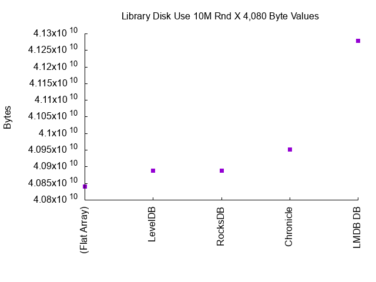

| Implementation | Bytes | Overhead % |
| -------------- | ----: | ---------: |
| (Flat Array) | 40,840,000,000 |  |
| LevelDB | 40,888,750,080 | .11 |
| RocksDB | 40,888,770,560 | .11 |
| Chronicle | 40,952,766,464 | .27 |
| LMDB DB | 41,279,459,328 | 1.07 |

With 4,080 byte values, storage efficiency is now excellent for all
implementations. This efficiency continues to increase in later tests.

#### Performance

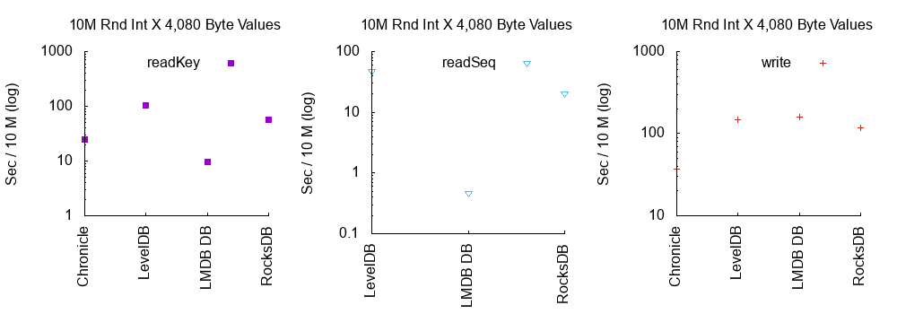

We can see the larger value sizes are starting to equal out the write speeds.
Chronicle Map continues to write the fastest, completing the 10M writes in just
37 seconds. The fastest sorting implementation is RocksDB at 116 seconds, soon
followed by LevelDB (147 seconds) and LMDB (159 seconds). LMDB offers the
fastest read performance.

### 76 GB Random Access of 8,176 Byte Values

#### Storage

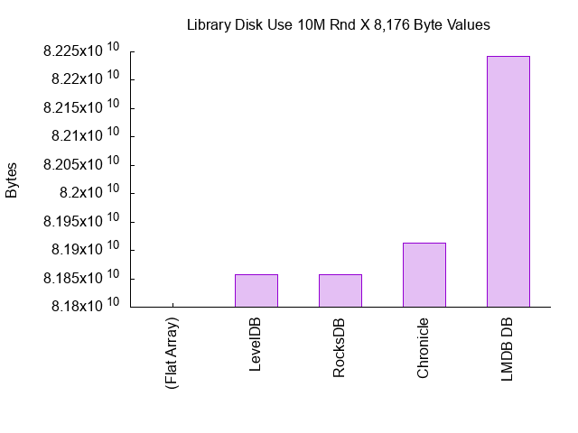

| Implementation | Bytes | Overhead % |
| -------------- | ----: | ---------: |
| (Flat Array) | 81,800,000,000 |  |
| LevelDB | 81,857,499,136 | .07 |
| RocksDB | 81,857,519,616 | .07 |
| Chronicle | 81,912,651,776 | .13 |
| LMDB DB | 82,241,519,616 | .53 |

The trend toward better storage efficiency with larger values has continued.

#### Performance

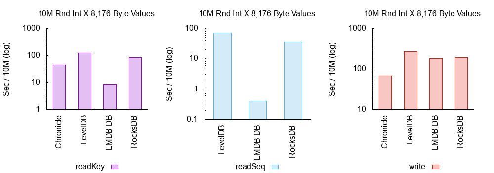

Now that much larger value keys are in use, we start to see the LSM
implementations slowed down by write amplification. With 8,176 byte values,
LMDB actually completes the write workload faster than the other sorted
implementations in 182 seconds. RocksDB comes in next at 192 seconds, and
finally LevelDB at 268 seconds. As usual, LMDB offers the fastest reads.

### 152 GB Random Access of 16,368 Byte Values

#### Storage

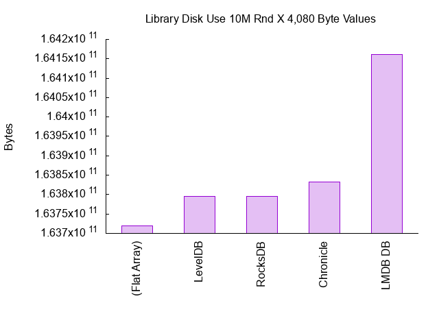

| Implementation | Bytes | Overhead % |
| -------------- | ----: | ---------: |
| (Flat Array) | 163,720,000,000 |  |
| LevelDB | 163,795,005,440 | .04 |
| RocksDB | 163,795,025,920 | .04 |
| Chronicle | 163,832,737,792 | .06 |
| LMDB DB | 164,160,393,216 | .26 |

In our final storage evaluation for this report, we see all implementations
offering very good storage space efficiency compared with a flat array. LMDB
continues to be the most inefficient at around one quarter of one percent
overhead, but this is unlikely to be an issue for most applications.

#### Performance

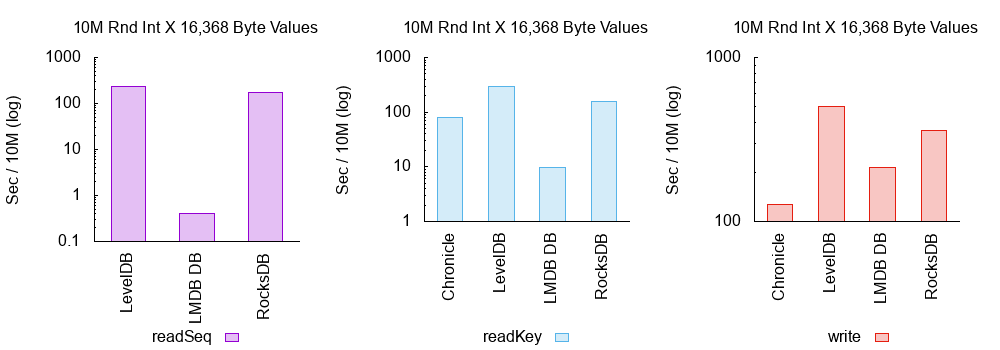

The write amplification issue seen with the earlier 8,176 byte benchmark
continues, with the LSM implementations further slowing down. LMDB completes the
write workload in 214 seconds, versus RocksDB in 358 and LevelDB in 500.

## Conclusion
After testing many workloads from 99 MB to 152 GB, we have seen a number of
important differences between the implementations.

Before discussing the ordered key implementations, it is noted that Chronicle
Map offers a good all-round option for unordered keys. It's consistently fast
for both reads and writes, plus storage space efficient. These properties are
demonstrated regardless of entry size. Chronicle Map also offers a fairly unique
feature set compared with the other embedded key-value stores in this report.
For example, it lacks transactions but does offer inter-node replication.

The focus of this report was on ordered key implementations, though. Those use
cases which can employ ordered keys will always achieve vastly better read
performance by iterating over a cursor. We saw this regardless of entry size,
original write ordering, or even implementation. It is worth devising a key
structure that enables ordered iteration whenever possible.

The pure Java implementations struggled as the workloads grew. MVStore performed
well in early tests, but ran out of memory when presented a 19 GB workload.
MapDB and Xodus both supported larger workloads, but their performance was
not ideal when compared with Chroncile Map, LMDB, RocksDB and LevelDB.

LMDB was always the fastest implementation for every read workload. This
is unsurprising given its B+ Tree and copy-on-write design. LMDB's excellent
read performance is sustained regardless of entry size or key access pattern.

The results are more complex for write workloads. For small value sizes (ie 100
bytes) we actually saw LMDB providing faster writes than the other sorted key
implementations. As value sizes approached 2 KB, we saw LMDB much slower than
RocksDB and LevelDB. However, once value sizes reached the 4 KB region, there
wasn't much difference between LMDB, LevelDB and RocksDB. At 8 KB values and
beyond, LMDB was materially faster for writes. This finding is readily explained
by the write amplification necessary in LSM-based implementations.

In terms of broader efficiency, LMDB operates in the same thread as its caller.
On the other hand, RocksDB and LevelDB require a second thread to perform their
write compaction. We see a similar story with operating system resource
consumption, with LMDB only requiring two open files. RocksDB and LevelDB both
require substantial numbers of open files to operate. RocksDB and LevelDB also
require careful tuning and batch sizing, whereas LMDB requires no such effort.

All implementations become more storage space efficient as the value sizes
increase. This is to be expected given more user data is represented in each
gigabyte. LMDB is relatively inefficient at small value sizes (65% overhead
with 100 byte values) but by the time values reach 4 KB the overhead becomes
immaterial (1% or below). Modern Java compression libraries such as
[LZ4-Java](https://github.com/jpountz/lz4-java) (for general-purpose cases)
and [JavaFastPFOR](https://github.com/lemire/JavaFastPFOR) (for integers) may
also offer end users enhanced options for packing related data into large,
chunked, compressed values. This may also improve performance if IO bottlenecks
are encountered, as the CPU can decompress while waiting on further IO.

The qualitative dimensions of each implementation should also be considered. For
example, consider recovery time from dirty shutdown (eg process/OS/server crash),
ACID transaction guarantees, inter-process usage flexibility, runtime monitoring
requirements, hot backup support and ongoing configuration effort. In these
situations LMDB delivers a very strong solution. For more information, see the
[LMDB Feature Comparison Chart](https://symas.com/products/lightning-memory-mapped-database/feature-comparison/).
